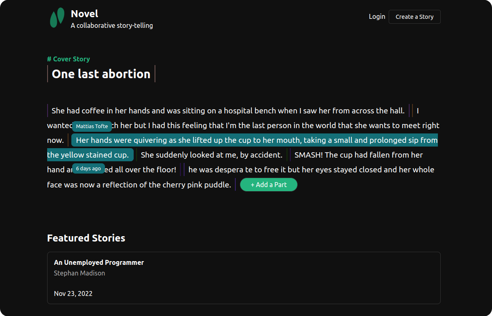

<p align="center">
    
</p>
<h1 align="center">Novel</h1>
<p align="center">A collaborative storytelling</p>




## Development

Novel is powered by Supabase and to run it locally you need to first create a Free account.


### Prerequisites  

- Postgres +v14
- Supabase
- NPM
- Git

### Clone Novel

First of all you need to clone Novel's repo:
```bash
git clone https://github.com/thevahidal/novel.git
```

### Supabase Project

Go to [supabase.com](https://supabase.com/) and create a new project. Name it whatever you want.

Inside you Supabase dashboard go to `Settings > Database > Connection string`. Copy your connection string. Note that the database password (that you provide while creating the project) is missing, make sure to fill the placeholder with your password.


Now while you're inside Novel's root directory, let's populate our Supabase database with Novel's schema:

```bash
psql [YOUR-CONNECTION-STRING] < db/schema.sql
```

Once it's finished go ahead and inside Supabase dashboard, Table Editor tab, you should see three tables: `stories`, `parts`, and `profiles`.

### Environment Variables

Duplicate `.env.example` file and rename it `.env`. Note that all variables are empty and we should fill them.

Now inside Supabase dashboard, go to `Settings > API > Project URL & Project API keys`. There you should copy three things:

- URL -> Copy this for `NEXT_PUBLIC_SUPABASE_URL`
- `anon` / `public` API key -> Copy this for `NEXT_PUBLIC_SUPABASE_ANON_KEY`
- `service_role` / `secret` API key -> Copy this for `SUPABASE_SECRET_KEY`

That's it. You can leave other variables to stay blank.

### Dependencies

Install the dependencies:

```bash
npm install
```

And finally let's run the development server:

```bash
npm run dev
```

Open [http://localhost:3000](http://localhost:3000) to see `Novel` in your browser.